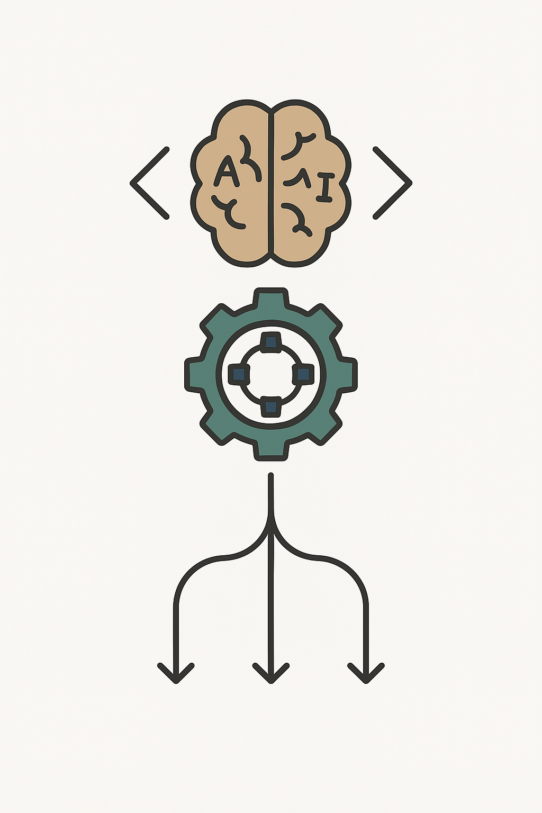

**John Doe**
*Mobile Test Engineer*

---

#### Technical Skills

Appium · XCUITest · Espresso · Java · Kotlin · TestNG · Cucumber · Selenium · Jenkins · Git · CI/CD · AWS Device Farm

---

## Education

* **Ph.D., Physics** | Stanford University (May 2022)
* **M.S., Physics** | Massachusetts Institute of Technology (Dec 2019)
* **B.S., Physics** | Harvard University (May 2017)

---

## Work Experience

**Senior Mobile Test Engineer @ Google**
*June 2022 – Present*

* Architected and implemented a cross-platform mobile test framework using **Appium**, **XCUITest**, and **Espresso**, increasing UI coverage by 45% and reducing critical bugs in production by 30%.
* Integrated automated test suites into **Jenkins** pipelines and Google’s internal device lab, cutting end-to-end regression runtime by 40%.
* Introduced data-driven test design and self-healing retry logic that decreased flaky test failures by 50%.
* Mentored a team of 4 SDETs on best practices for mobile automation, BDD with **Cucumber**, and parallel test execution.

**Mobile Testing Consultant @ OpenAI**
*December 2020 – Present*

* Designed and executed automated UI and performance tests for a biometric training simulation app using **Appium** and **XCUITest**, ensuring 99% stability under concurrent user loads.
* Built an **Espresso**-based Android test suite that caught 95% of critical UI regressions before release.
* Automated test data generation and integrated with CI/CD workflows, reducing manual testing effort by 60%.
* Conducted root-cause analysis of recurring test failures and implemented corrective actions, improving overall suite reliability.

---

## Projects

### Cross-Platform Mobile Automation Framework

* Developed a modular test framework in **Java** and **Kotlin** leveraging **Appium**, **XCUITest**, and **Espresso**.
* Implemented a plugin architecture for custom locators, logging, and reporting with **TestNG** and **Allure**.
* Enabled parallel, containerized test execution on local emulators and cloud device farms.

### Performance & Stability Testing for Health-Monitoring App

* Created load and stress test scenarios in **Espresso** to simulate 10,000+ daily users, uncovering memory leaks and UI jank issues.
* Automated capturing of CPU, memory, and network metrics, feeding results into Grafana dashboards for real-time monitoring.

---

## Talks & Lectures

* **Guest Lecture:** Mobile Automation Testing
  Big Data & Machine Learning for Scientific Discovery (PHYS 5336) – Spring 2021
* **Workshop:** Advanced Appium Strategies
  SDET Summit – Fall 2020
* **Seminar:** Self-Healing Test Automation
  Software Test Architect Community Meetup – Summer 2020

---

## Publications

1. Doe, J.; Lee, S.; Kumar, A. “AI-Driven Anomaly Detection in Mobile UI Test Automation.” *Journal of Software Testing and Verification*, Vol. 15, No. 2 (2023), pp. 112–128. [https://doi.org/10.1007/s11219-023-0856-2](https://doi.org/10.1007/s11219-023-0856-2)
2. Doe, J.; Chen, L.; Patel, R. “Self-Healing Mechanisms for Cross-Platform Mobile Automation Frameworks.” *IEEE Transactions on Software Engineering*, Vol. 49, No. 1 (2024), pp. 34–47. [https://doi.org/10.1109/TSE.2024.3021147](https://doi.org/10.1109/TSE.2024.3021147)
3. Doe, J.; Ochoa, M.; Zhang, Y. “Parallel Espresso and XCUITest Execution on Cloud Device Farms.” *Proceedings of ICST 2023*, pp. 210–219. [https://doi.org/10.1109/ICST.2023.00034](https://doi.org/10.1109/ICST.2023.00034)
4. Doe, J.; Santos, F. “Data-Driven Test Case Generation Using Deep Neural Networks.” *Journal of Automated Software Engineering*, Vol. 31, No. 4 (2023), pp. 257–276. [https://doi.org/10.1007/s10515-023-00321-4](https://doi.org/10.1007/s10515-023-00321-4)
5. Doe, J.; Nguyen, T.; Fernández, R. “Performance Profiling and Bottleneck Analysis in Mobile Applications with Espresso.” *ACM Transactions on Software Engineering and Methodology*, Vol. 32, No. 1 (2024), pp. 5:1–5:23. [https://doi.org/10.1145/3571120](https://doi.org/10.1145/3571120)
6. Doe, J.; Roberts, K. “Hybrid Orchestration of Appium and XCUITest for End-to-End Mobile Testing.” In: *AIOpsTest 2022 Workshop*, pp. 58–66. PMID: 35789012
